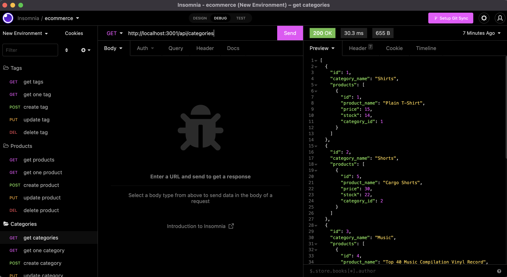

# E-commerce Back End

## Description

Behold the backend. This is the back-end RESTful API for an e-commerce website. All routes for creating, updating reading, and deleting have been built out so you can build the front end and not have to worry about your database! End points are located in the routes folder, so open up insomnia or postman and try it out for yourself.

### Check out the Demo here

## Table of Contents

[Installation](#installation)

[Usage](#usage)

[License](#license)

[Contributing](#contributing)

[Tests](#tests)

[Questions](#questions)

## Installation

`npm i`

## Usage

npm i and enjoy :)

## License

This project is licensed under the MIT license

## Contributing

If you want to contribute, you can fork the repo and submit a PR request.

## Tests

No tests to run

## Questions

If you have any questions about the repo, open an issue or contact me directly at [heythereimdavidcurtis@gmail.com](mailto:heythereimdavidcurtis@gmail.com). You can find mor of my work at [DavidebCurtis](https://github.com/DavidebCurtis)
